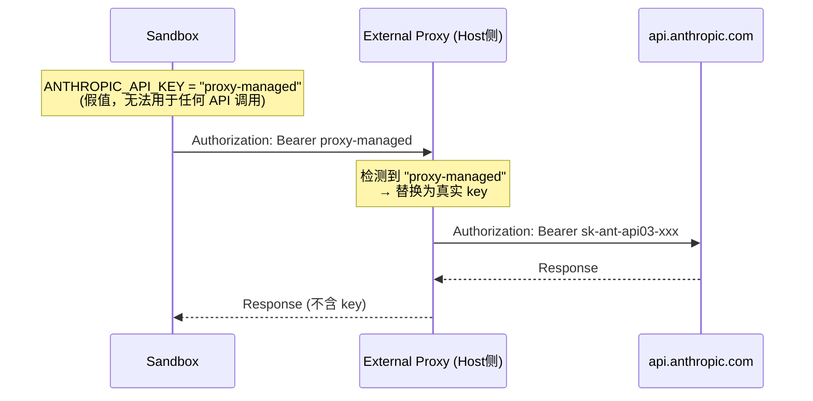
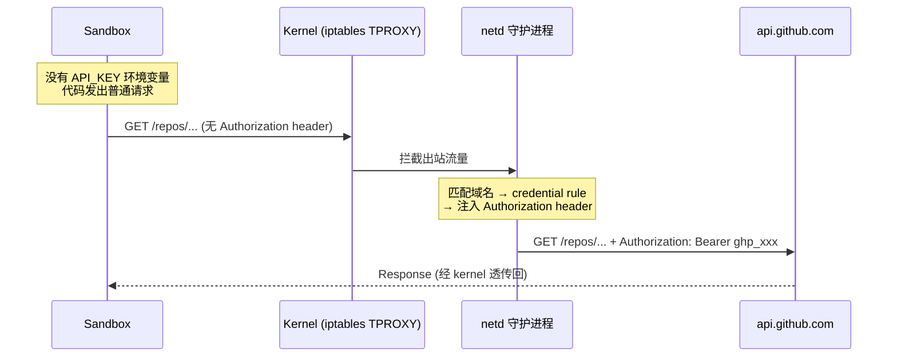
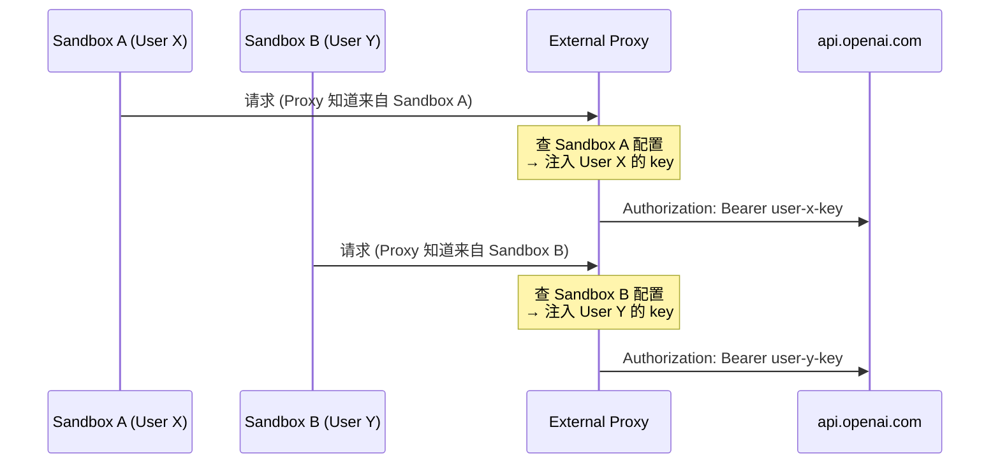

AI Agent Sandbox 中的 Key 安全：三个级别的演进

AI Agent Sandbox 中的 Key 安全：三个级别的演进

AI Agent Sandbox 中的 Key 安全：三个级别的演进

# AI Agent Sandbox 中的 Key 安全：三个级别的演进

> AI Agent 需要调用外部 API，但 sandbox 内的代码不可信。如何让 agent 能用 key，又拿不到 key？本文基于 Vercel、Docker、Cloudflare、OWASP 等一手资料，梳理业界三个安全级别的演进。

---

## 目录

- [问题：Sandbox 内的代码不可信](#问题sandbox-内的代码不可信)
- [Level 1：Key 以明文注入环境变量](#level-1key-以明文注入环境变量)
- [Level 2：Sentinel Value + 外部 Proxy 注入](#level-2sentinel-value--外部-proxy-注入)
- [Level 3：零 Credential + Kernel 层注入](#level-3零-credential--kernel-层注入)
- [总结](#总结)
- [Appendix A：Level 2 的 Proxy 如何识别注入哪个 Key](#appendix-alevel-2-的-proxy-如何识别注入哪个-key)
- [Appendix B：OWASP 原文澄清——标准的边界在哪里](#appendix-bowasp-原文澄清标准的边界在哪里)
- [Appendix C：E2B 用户的真实痛点](#appendix-ce2b-用户的真实痛点)
- [参考资料](#参考资料)

---

## 问题：Sandbox 内的代码不可信

AI Agent 在 sandbox 中运行用户代码、生成代码、调用外部 API。这些代码可能被 prompt injection 劫持，做出开发者未预期的行为——包括窃取 API key。

Vercel CTO Malte Ubl 在其博客中描述了一个典型攻击场景：agent 读取一个包含注入指令的日志文件，被诱导生成脚本将 `~/.ssh` 和 `~/.aws/credentials` 发送到外部服务器。攻击成功的根本原因是：**agent、agent 生成的代码、以及基础设施的 credential 共享了同一个安全上下文** [[1]](#参考资料)。

因此，核心问题是：

> **Sandbox 内的代码需要调用外部 API，但又不能让它拿到真实的 key。**

---

## Level 1：Key 以明文注入环境变量

### 做法

Sandbox 启动时，把真实 key（或 scoped virtual key）写进环境变量，sandbox 内的代码直接读取使用。

```python
# E2B 官方文档示例 [2]
sandbox = Sandbox.create("codex", envs={
    "CODEX_API_KEY": os.environ["CODEX_API_KEY"],
})
```

### 安全属性

Sandbox 内任何进程都能读到 key：

```bash
echo $CODEX_API_KEY    # 直接拿到明文
```

恶意代码可以把 key 发送到外部服务器、写入日志、或传递给下游调用。

### 谁这么做

- **E2B** — 官方文档示例即如此 [[2]](#参考资料)
- **Sandbox Agent SDK** — 推荐的 "per-tenant gateway" 模式 [[3]](#参考资料)
- 大量 AI agent 平台的默认配置

### 业界怎么评价

Sandbox Agent SDK 文档原文 [[3]](#参考资料)：

> "LLM credentials are passed into the sandbox as environment variables. The agent and **everything inside the sandbox has access to the token**, so it's important to choose the right strategy for how you provision and scope these credentials."

### 常见的缓解措施

| 措施 | 效果 | 局限 |
|:-----|:-----|:-----|
| 使用 LLM gateway（如 LiteLLM [[5]](#参考资料)）签发 virtual key | 真实 provider key 不进 sandbox | virtual key 仍在 sandbox 内可见 |
| virtual key 设置预算上限和 TTL | 限制滥用损失 | key 在 TTL 内仍可被提取和使用 |
| virtual key 仅对 gateway 有效 | 发到其他域名无用 | 不防止对 gateway 本身的滥用 |
| pipeline 结束时立即 block key | 消除 TTL 窗口 | 仅在 block 调用成功时有效 |

加上这些缓解措施后（特别是"pipeline 结束立即 block"），Level 1 可以满足 OWASP ASI03 的要求（见 [Appendix B](#appendix-bowasp-原文澄清标准的边界在哪里)），但 key 仍然在 sandbox 内**可见、可提取**。

---

## Level 2：Sentinel Value + 外部 Proxy 注入

### 做法

Sandbox 内的环境变量是一个**无用的占位值**（sentinel），真实 key 存在 sandbox 外部的 proxy 里。Sandbox 发出 HTTP 请求时，外部 proxy 拦截请求，替换掉占位值，注入真实 key，再转发到目标 API。



### 安全属性

Sandbox 内任何进程读到的都是假值：

```bash
echo $ANTHROPIC_API_KEY    # 输出 "proxy-managed"（无法用于任何 API 调用）
```

即使 sandbox 被完全攻陷（root 权限、读遍文件系统和内存），也拿不到真实 key——因为真实 key **物理上不在这个 VM 里**。

### 关键设计点：Proxy 必须在 Sandbox 外面

Proxy 如果在 sandbox 内部（同一个 VM），攻击者拥有 root 权限后可以读取 proxy 的内存、CA 私钥、修改网络规则，proxy 的安全保障就不存在了。

Docker 文档解释了为什么必须在外面 [[6]](#参考资料)：

> "The primary trust boundary is the microVM. The agent has full control inside the VM, including sudo access. **The VM boundary prevents the agent from reaching anything on your host.**"

### Header 覆盖防护

Vercel 的 credential brokering 有一个关键机制——proxy 注入的 header **强制覆盖** sandbox 代码设置的同名 header [[1]](#参考资料)：

> "Injected headers overwrite any headers the sandbox code sets with the same name, preventing credential substitution attacks."

这防止了一类攻击：攻击者在 sandbox 内伪造 `Authorization: Bearer attacker-own-key` 发到白名单域名，试图用自己的 key 向合法服务上传数据。Proxy 的 overwrite 机制会将其替换为真实 key，攻击者的 key 永远到达不了目标服务器。

### 谁这么做（生产环境证据）

#### Vercel Sandbox

CTO Malte Ubl 博客原文 [[1]](#参考资料)：

> "Secrets are injected at the network level, never exposed where generated code could access the secrets directly."

Vercel changelog（2026-02-23）原文 [[7]](#参考资料)：

> "Even if an agent is compromised, there's nothing to exfiltrate, as the credentials only exist in a layer outside the VM."

Notion 在生产环境使用 Vercel Sandbox 运行 AI agent [[8]](#参考资料)：

> "Credential security: Notion Workers need API keys to talk to external services, but those secrets can never be exposed to the code itself."

#### Docker Sandboxes

官方文档原文 [[9]](#参考资料)：

> "The real credential stays on the host; the sandbox sees only a sentinel value."

> "Credential values are never stored inside the VM. They are not available as environment variables or files inside the sandbox."

支持 Claude Code、OpenAI Codex、OpenCode 等主流 AI agent，并提供组织级策略管理 [[6]](#参考资料)。

#### Cloudflare Sandboxes

官方博客（2026-04-13）原文 [[10]](#参考资料)：

> "Our ephemeral private key and CA will **never leave our container runtime sidecar process**, and is never shared across other container sidecar processes."

Cloudflare changelog [[11]](#参考资料)：

> "No token is ever passed into the sandbox. You can rotate secrets in the Worker environment and every request will pick them up immediately."

支持动态策略更新——可以在 sandbox 运行期间更改 credential 注入规则，无需重启进程。

### Level 2 仍然挡不住什么

Vercel CTO 在同一篇博客中坦承 [[1]](#参考资料)：

> "The proxy prevents exfiltration. Secrets can't be copied out of the execution context and reused elsewhere. But the proxy **doesn't prevent misuse during active runtime**. Generated software can still make unexpected API calls using the injected credentials while the system is running."

也就是说：攻击者虽然带不走 key，但在 sandbox 存活期间，可以通过 proxy 使用 key 向合法目标发起请求（例如删除数据、发起转账）。

**Level 2 解决的是 key 提取（exfiltration）问题，不是 key 滥用（misuse）问题。**

### 防 Runtime Misuse 的工程手段

Level 2 的 proxy 除了注入 credential，还可以在请求层面限制"能做什么"。以下是厂商已经提供的能力：

**Vercel Sandbox firewall** 支持 per-domain 的请求匹配器（matcher），可按 path、method、query、header 维度限制哪些请求被注入 credential [[16]](#参考资料)：

> "Each rule can define a set of matchers on the path, method, query parameters, and headers. When defined, only requests matching the specified dimensions will be transformed."

示例：只允许 GET 请求被注入 credential，拒绝 DELETE/POST：

```typescript
const sandbox = await Sandbox.create({
  networkPolicy: {
    allow: {
      "api.stripe.com": [{
        match: { method: ["GET"] },
        transform: [{
          headers: { Authorization: `Bearer ${stripeKey}` }
        }],
      }],
    }
  }
});
```

**Docker Sandboxes** 支持域名白名单 + 协议级阻断（raw TCP/UDP/ICMP 全部阻断）[[6]](#参考资料)。

**Cloudflare Sandboxes** 支持动态策略更新——多阶段工作流中，先开放网络安装依赖，再锁死策略执行不可信代码 [[10]](#参考资料)。

结合 Level 1 的缓解措施（scoped token、预算上限、短 TTL），runtime misuse 的 blast radius 可以被有效控制：

| 防御层 | 防什么 |
|:-------|:-------|
| 域名白名单 | 只能打允许的 API，不能访问其他服务 |
| Method/Path matcher | 只能做允许的操作（如只读不写） |
| 预算上限 | 超额自动拒绝 |
| 短 TTL + pipeline 结束即 block | 限制滥用时间窗口 |
| 审计日志 | 事后追溯每一次 API 调用 |

这些手段不能完全消除 misuse，但可以将其限制在可接受的范围内。

---

## Level 3：零 Credential + Kernel 层注入

### 做法

Sandbox 内**什么 credential 都没有**——连假值、占位符、sentinel 都没有。Credential 在 kernel 网络层（iptables TPROXY）透明注入，sandbox 进程完全不知道有 proxy 存在。



### 和 Level 2 的区别

| | Level 2 | Level 3 |
|:---|:---|:---|
| sandbox 内有什么 | `proxy-managed`（假值） | **什么都没有** |
| `echo $API_KEY` | 输出假值 | 空 / 未设置 |
| 代码需要配合吗 | 需要（env var 设假值，让 SDK 不报错） | 不需要（普通 HTTP 请求即可） |

Sandbox0 博客原文 [[13]](#参考资料)：

> "There is **no fake credential to steal**. There is nothing in the agent's process environment that represents the real key, or a stand-in for it."

> "The Phantom Token Pattern still places a credential — a fake one — in the agent's process environment, and requires the agent's SDK to connect to a localhost proxy. Sandbox0's approach uses kernel-level traffic interception (iptables TPROXY) so the agent makes a completely normal network connection to the real destination."

### 当前状态

| 维度 | 状态 |
|:---|:---|
| 产品成熟度 | `v0.1.0-rc.5`（release candidate）[[14]](#参考资料) |
| 许可证 | Apache 2.0，开源 |
| 公开客户案例 | 无 |
| 第三方安全审计 | 无公开记录 |
| 其他厂商采用 | 无 |
| OWASP 提及 | 未提及 |

**Level 3 是有前景的探索方向，但目前不是经过生产验证的最佳实践。**

---

## 总结

| | Level 1 | Level 2 | Level 3 |
|:---|:---|:---|:---|
| **sandbox 内可见** | 真实 key 明文 | 假值（无用） | 什么都没有 |
| **key 可被提取** | 一行 `echo` | 不能 | 不能 |
| **proxy 位置** | 无 / sandbox 内 | **sandbox 外（host 侧）** | **kernel 层** |
| **防 key 提取** | ❌ | ✅ | ✅ |
| **防 key 滥用** | ❌（仅靠预算/TTL） | ⚠️（proxy 可限制 method/path） | ⚠️（proxy 可限制 method/path） |
| **OWASP ASI03 合规** | ✅（需加缓解措施） | ✅ | ✅ |
| **生产验证** | E2B 默认 | **Vercel + Docker + Cloudflare** | Sandbox0（RC 阶段） |

### 选择建议

| 场景 | 推荐级别 | 理由 |
|:---|:---|:---|
| 内部工具、开发环境、key blast radius 小 | **Level 1 + 缓解措施** | key 可见可提取，但 scoped virtual key + 预算 + 短 TTL + pipeline 结束即 block 可控风险 |
| 用户 credential、生产资源、面向外部用户的产品 | **Level 2 + Level 1 缓解措施** | Level 2 从根本上消除提取风险；Level 1 的缓解措施（scoped token、预算上限、短 TTL）+ proxy 层的 method/path matcher 共同限制运行时滥用 |
| 追求前沿安全架构 | **关注 Level 3** | 等更多厂商验证后再采用 |

### 一条通用原则

无论选择哪个级别：

> **Credential 的生命周期应该匹配 task 的生命周期，不是日历时间。** [[17]](#参考资料)
>
> 一个跑 30 秒的 task，credential 应该在几分钟内过期，而不是 180 分钟。

---

## Appendix A：Level 2 的 Proxy 如何识别注入哪个 Key

不同用户、不同 pipeline 需要不同的 key。外部 proxy 如何知道该为当前请求注入哪个 key？

### 核心原理

每个 sandbox 是独立的 microVM，有独立的网络命名空间。Proxy 在网络层天然能区分流量来自哪个 VM，不需要 sandbox 内的代码做任何标识。



### 三家厂商的具体实现

#### Vercel：创建 sandbox 时绑定 credential 规则

每个 sandbox 创建时，调用方在 sandbox 外部配置好该实例的注入规则。Proxy 按 sandbox 实例维度执行注入：

```typescript
// 平台后端代码（sandbox 外部），为用户 X 创建 sandbox
const sandboxForUserX = await Sandbox.create({
  networkPolicy: {
    allow: {
      "api.openai.com": [{
        transform: [{
          headers: { Authorization: `Bearer ${userX.openaiKey}` }
        }],
      }],
    }
  }
});
```

每个 sandbox 实例有自己的 networkPolicy，不同用户对应不同的 sandbox 实例和不同的注入规则。

#### Cloudflare：通过 `ctx.containerId` 查询 per-instance credential

Proxy（outbound Worker）运行时能拿到当前 sandbox 的唯一 ID，用它从 KV 存储查出对应的 key [[11]](#参考资料)：

```typescript
// Cloudflare 官方文档示例
MySandbox.outboundByHost = {
  "my-internal-vcs.dev": async (request, env, ctx) => {
    // ctx.containerId 是当前 sandbox 的唯一标识
    const authKey = await env.KEYS.get(ctx.containerId);
    const requestWithAuth = new Request(request);
    requestWithAuth.headers.set("x-auth-token", authKey);
    return fetch(requestWithAuth);
  },
};
```

平台在创建 sandbox 时，把用户的 key 写入 KV（key = containerId, value = 用户的 credential）。

#### Docker Sandboxes：sandbox scope + service identifier

每个 sandbox 有自己的 secret 存储，proxy 按「当前 sandbox + 目标域名」匹配 [[9]](#参考资料)：

```bash
# 为不同 sandbox 存储不同的 credential
sbx secret set sandbox-user-x openai    # sandbox-user-x 用 key A
sbx secret set sandbox-user-y openai    # sandbox-user-y 用 key B
```

### 为什么不需要 sandbox 内的代码配合

因为 proxy 在 sandbox **外部**（host 侧），它在网络层就知道流量来自哪个 VM。这和 sandbox 内部的 proxy 方案不同——内部 proxy 需要 sandbox 代码主动带上身份标识（如 token header），而外部 proxy 天然拥有这个信息。

---

## Appendix B：OWASP 原文澄清——标准的边界在哪里

### OWASP ASI03 原文（PDF 第 17 页）[[4]](#参考资料)

> "**Enforce Task-Scoped, Time-Bound Permissions**: Issue short-lived, narrowly scoped tokens per task and cap rights with permission boundaries - using per-agent identities and short-lived credentials (e.g., mTLS certificates or scoped tokens) - to limit blast radius, block delegated-abuse and maintenance-window attacks, and mitigate un-scoped inheritance, orphaned privileges, and reflection-loop elevation."

### OWASP 要求的是什么

| 要求 | 原文依据 |
|:-----|:---------|
| Short-lived | "short-lived credentials" |
| Narrowly scoped | "narrowly scoped tokens per task" |
| Per task | "per task" |
| Permission boundaries | "cap rights with permission boundaries" |

### OWASP 没有要求什么

OWASP ASI03 原文**没有**明确要求 "credential 不能出现在 sandbox 环境变量里"。它要求的是 token 要短期、窄权限、按任务签发——这些 Level 1 加缓解措施后可以满足。

### "Credential 不进 sandbox" 的来源

这个更高标准来自**厂商工程实践**和**第三方实施指南**，不是 OWASP 标准本身的最低要求：

| 来源 | 原文 | 性质 |
|:-----|:-----|:-----|
| **OWASP ASI03 官方** [[4]](#参考资料) | "Issue short-lived, narrowly scoped tokens per task" | 标准要求（Level 1 + 缓解措施可满足） |
| systemprompt.io 实施指南 [[12]](#参考资料) | "secrets are never exposed to the agent or the model" | 第三方对 OWASP 的解读 |
| Vercel CTO 博客 [[1]](#参考资料) | "never exposed where generated code could access" | 厂商工程实践 |
| Docker 官方文档 [[9]](#参考资料) | "credential values are never stored inside the VM" | 厂商工程实践 |

### 结论

- **Level 1 + 完整缓解措施**（short-lived + scoped + per-task + 立即 block）→ 符合 OWASP ASI03 要求
- **Level 2**（credential 不进 sandbox）→ 超越 OWASP 要求，是头部厂商的工程实践

两者的区别在于：Level 1 靠"泄露后损失可控"兜底，Level 2 靠"不可能泄露"从根本上消除风险。选择哪个取决于你的威胁模型和平台约束。

---

## Appendix C：E2B 用户的真实痛点

E2B 是目前使用最广泛的 AI agent sandbox 平台之一。其 GitHub Issue #1160 [[15]](#参考资料)（2026-02-25，11 个 👍）记录了用户对 Level 1 方案的真实痛点。

### Issue 作者 @hewliyang 原文

> "**We must have some way of passing credentials outside of the VM layer in order to avoid exfiltration attacks.**"
>
> "Vercel released credential brokering for HTTP(S) egress by intercepting and transforming the request."

### 用户 @nspady 的评论（2026-03-05）

> "We run Claude Code in E2B sandboxes that need to make authenticated API calls to our backend. Today that means **passing bearer tokens as env vars inside the VM, which are exfiltrable via prompt injection**. We've mitigated with short TTLs and scoped tokens, but **credential injection outside the VM is the only architectural fix**. Would love to help test early builds."

### 被引用为竞争分析依据

该 Issue 被其他项目作为 E2B 的安全缺陷引用：
- `telvm-hq/telvm#16`: "Competitive Analysis: Key Gaps in E2B & Daytona That telvm Can Exploit"

### Issue 提出的技术方案

@hewliyang 提出了参照 Vercel 的方案：

```typescript
const sandbox = await Sandbox.create('template-id', {
  network: {
    denyOut: [ALL_TRAFFIC],
    allowOut: ['api.openai.com', '*.github.com'],
    egressTransform: {
      'api.openai.com': {
        headers: { Authorization: `Bearer ${process.env.OPENAI_API_KEY}` },
      },
      '*.github.com': {
        headers: { Authorization: `Bearer ${process.env.GITHUB_TOKEN}` },
      },
    },
  },
});
```

### 当前状态

截至 2026-05-15，E2B 尚未正式发布此功能。Issue 仍处于 open 状态。

---

## 参考资料

| # | 来源 | 链接 |
|:---|:---|:---|
| 1 | Vercel Blog — Security boundaries in agentic architectures (Malte Ubl, 2026-02-24) | [vercel.com/blog/security-boundaries-in-agentic-architectures](https://vercel.com/blog/security-boundaries-in-agentic-architectures) |
| 2 | E2B Documentation — Codex agent | [e2b.dev/docs/agents/codex](https://e2b.dev/docs/agents/codex) |
| 3 | Sandbox Agent SDK — LLM Credentials | [sandboxagent.dev/docs/llm-credentials](https://sandboxagent.dev/docs/llm-credentials) |
| 4 | OWASP Top 10 for Agentic AI (ASI03: Identity and Privilege Abuse, PDF p.17) | [genai.owasp.org/resource/owasp-top-10-for-agentic-applications-for-2026/](https://genai.owasp.org/resource/owasp-top-10-for-agentic-applications-for-2026/) |
| 5 | LiteLLM — Virtual Keys | [docs.litellm.ai/docs/proxy/virtual_keys](https://docs.litellm.ai/docs/proxy/virtual_keys) |
| 6 | Docker Docs — Sandbox Isolation layers | [docs.docker.com/ai/sandboxes/security/isolation/](https://docs.docker.com/ai/sandboxes/security/isolation/) |
| 7 | Vercel Changelog — Safely inject credentials (2026-02-23) | [vercel.com/changelog/safely-inject-credentials-in-http-headers-with-vercel-sandbox](https://vercel.com/changelog/safely-inject-credentials-in-http-headers-with-vercel-sandbox) |
| 8 | Vercel Blog — How Notion Workers run untrusted code at scale (2026-03-12) | [vercel.com/blog/notion-workers-vercel-sandbox](https://vercel.com/blog/notion-workers-vercel-sandbox) |
| 9 | Docker Docs — Sandbox Credentials | [docs.docker.com/ai/sandboxes/security/credentials/](https://docs.docker.com/ai/sandboxes/security/credentials/) |
| 10 | Cloudflare Blog — Dynamic, identity-aware, and secure Sandbox auth (2026-04-13) | [blog.cloudflare.com/sandbox-auth/](https://blog.cloudflare.com/sandbox-auth/) |
| 11 | Cloudflare Changelog — Secure credential injection for Sandboxes (2026-04-13) | [developers.cloudflare.com/changelog/post/2026-04-13-sandbox-outbound-workers-tls-auth/](https://developers.cloudflare.com/changelog/post/2026-04-13-sandbox-outbound-workers-tls-auth/) |
| 12 | OWASP Top 10 for Agentic AI Implementation Guide (systemprompt.io) | [systemprompt.io/guides/owasp-agentic-top-10-implementation](https://systemprompt.io/guides/owasp-agentic-top-10-implementation) |
| 13 | Sandbox0 Blog — Keep API Keys Out of AI Agents | [sandbox0.ai/blog/2026-03/keep-api-keys-out-of-ai-agents](https://sandbox0.ai/blog/2026-03/keep-api-keys-out-of-ai-agents) |
| 14 | Sandbox0 GitHub Repository | [github.com/sandbox0-ai/sandbox0](https://github.com/sandbox0-ai/sandbox0) |
| 15 | E2B GitHub Issue #1160 — Credential/Secret Brokering for HTTP(S) Requests | [github.com/e2b-dev/E2B/issues/1160](https://github.com/e2b-dev/E2B/issues/1160) |
| 16 | Vercel Docs — Sandbox firewall (credentials brokering matchers) | [vercel.com/docs/vercel-sandbox/concepts/firewall](https://vercel.com/docs/vercel-sandbox/concepts/firewall) |
| 17 | Supergood Solutions — Secrets Management in Agent Environments (2026-03-22) | [supergood.solutions/blog/secrets-management-agent-environments-2026](https://supergood.solutions/blog/secrets-management-agent-environments-2026/) |
